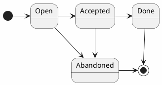

# Front Matter

```
Title           : Documentation restructure and RFC process
Category        : Process
Author(s)       : Wojciech Polak
Team            : CommonDataLayer
Reviewer        : CommonDataLayer
Created         : 2021-07-02
Last updated    : 2021-07-02
Version         : 1.0.0
```

# Glossary

RFC - Request for Comments

# Preface

This RFC introduces a new process to keep our documentation clean and up-to-date. Both subjects - documentation restructure and RFC process are married and cannot be discussed separately.

# Documentation restructure

## Goal
To simplify, clarify documentation structure. What documents should be grouped in what categories. Also, to define what the categories are and what these purposes are.

## What we have now

```
architecture - information about each component - very brief. Almost 70% of the architecture documentation takes information about configuration and environment variables. This information is outdated.

configuration - newest created directory, description of all ENV variables, and configuration files. It is up to date.

deployment - documentation how to deploy CDL

examples - empty

features - brief information about main features like client routing, materialization, and ordering. materialization.md is only an outdated tutorial without further explanation of the goal and overall design.

rfc - directory where we keep all RFC, mixed processes, abandoned RFCs, implemented features, and WIP features.

SUMMARY.md - the main index must be updated whenever we add a new document—often forgotten and outdated. It is used to generate a sidebar with navigation. Very important.

benchmarks.md - empty, TODO

getting_started.md - simple, outdated tutorial on how to play with CDL

how_it_works.md - Simple, probably also outdated, three paragraphs on how CDL works internally. Very brief.

index.md - First file seen when someone visits docs.commondatalayer.org

protocol.md - empty, TODO

schemas_and_views.md - few paragraphs explaining what schema and view is. It is very much outdated before we started materialization.

versioning.md - brief information about CDL and SemVer. It also describes our branching or tagging strategy and releases schedule. I will be outdated very quickly.
```

## What should we have

Please, keep in mind that an explanation for these changes is written in the next section describing the RFC process.

```
architecture
Purpose: information about each component, schema registry, object builder, and other applications. It should only contain our internal architecture description, the current state of each element. Information what it does, why and how, what algorithms (from a broad perspective without many implementation details) were used, the protocol between the systems, etc. It should be enough information to adapt a new developer to CDL quickly. 
Change: remove ENV variables as these are duplicated in the following directory.
Used by: CDL team

configuration
Purpose: Description of all ENV variables and configuration files
Change: No changes needed
Used by: CDL user

deployment
Purpose: Documentation of how to deploy CDL
Change: No changes needed
Used by: CDL user

examples
Purpose: a place for tutorials (for example, the one living right now in features/materialization.md, although it needs an update) and guides.
Change: Move features/materialization.md, also maybe getting_started.md
Used by: CDL user

features
Purpose: a place for feature (behavior) description. Each feature should have at least one document describing it. Example: ordering.md, materialization.md, routing.md, CDLIM_versioning.md
Change: Rewrite materialization.md by precisely describing what this feature is. Rest should be kept as it is, especially index.md with table linking feature with RFC and documentation.
Used by: CDL user

processes
Purpose: a place for all our processes. For example: Commit message formalization or this RFC when it's going to be accepted.
Change: New directory. There is no need for index.md because of SUMMARY.md
Used by: CDL team

rfc
Purpose: a place for all RFCs.
Change: Tag all RFCs with their status. Create features/processes based on RFCs that are closed. There is no need for index.md because of SUMMARY.md.
Used by: CDL team

...
The rest is not that important for now. CDL team should create an issue to clean and update these, but there is no point in discussing these now.
```
# RFC process

## Goal
To simplify, clarify our methodology. To explain what should be included in RFC and what steps should be included in the RFC process.

## What we have now

### RFC definition
RFC is describing either the change or current state of the CDL. It might refer to other RFC and the current state of CDL. 
There is no definition of what RFC is and what it should include.

### Structure
We keep all RFCs in the `rfc` directory; however, there is little to no resolution after we close it.
Description of the components is mixed with RFCs describing features and processes, resulting in a strange mess where NAF-Commit_message...md lives next to `CDLF-000XX-rfc-XX.md`. 

## What should we have

RFC should only describe **change** to CDL. The change might be:
* New feature
* Modification of existing feature
* New process
* Modification of existing process

It should not contain information about a single component (its current state, as this is the purpose of `architecture`).

### RFC Category

Each RFC must contain a category informing whether it describes the feature or the process.
Accepted values: `Feature`/`Process`.

### RFC Status
Each RFC must contain information about its status.

Request for Change might be:

* Open (accepting new comments), 
* Accepted (tracking issue has been created, RFC should also contain its ID: `Accepted(#123)`)
* Done (implementation/process description has been merged to trunk branch, RFC should also contain PR ID: `Done(#456)`),
* Abandoned (Team decided not to implement it)

### RFC Deadline

Each RFC must contain a deadline to speed up the process.
Before the deadline is met, the author should remind all interested parties about it.

If the deadline is met without conclusion, the author of the RFC should create a meeting and invite all interested in these RFC parties. Then during this meeting resolution has to be made.

There may be exceptions to this rule - for example, when during a deadline meeting, everyone agrees to wait for new information from superiors, etc.

### The process

#### Draft
The author of the RFC should create a new document in the `rfc` directory. This directory has a flat structure, and each RFC should have a filename in human-readable format with version prefix number: for example: `schema_registry_less_CDL_deployment_01.md`.

Version prefix number is increased when RFC describes changes for existing RFC; for example, when there is `materialization_01.md` defining the first phase of materialization, and the author wants to describe the second phase, they should write `materialization_02.md`

Each RFC has to contain Front Matter in the format:
```` 
# Front Matter

```
Title           : Schema-Registry-less CDL deployment
Category        : Feature
Status          : Done(#123)
Author(s)       : Wojciech Polak
Team            : CommonDataLayer
Reviewer        : CommonDataLayer
Created         : 2021-06-24
Last updated    : 2021-06-24
Deadline        : 2021-06-26
Version         : 1.0.0
CDL feature ID  : CDLF-00016-00
Abandon reason  : Reason
```
```` 

CDL feature ID is required only for the feature description. If RFC describes the process, this field should be omitted.

Abandon reason is required only for Status: `Abandoned`.

The author should commit the draft to a separate branch, preferably `rfc/<filename>`.

#### Pull Request
When the draft is ready for review, an author should create PR and inform CDL Team.

#### Resolution
Each RFC must result (depending on its state) in:
* Open - RFC should be updated with the new deadline
* Accepted - tracking issue should be created in CDL Team backlog. This tracking issue can contain more than one subtasks (sub-issues).
* Done
    * Update in `architecture` - all components that were changed should be updated, so this RFC won't be needed to understand how for example, Object Builder works. It should be done as a part of PR that has been merged.
    * Update in `features` - if RFCs category is `Feature` - Update existing or create new feature.md and write a new description of what this feature does. In some cases, the author can selectively copy-paste it from RFC; however, the author must be careful. It should be done as a part of PR that has been merged.
    * Update in `processes` - if RFCs category is `Process` - Update existing or create a new process.md and write a further description of how the process looks. In some cases, the author can selectively copy-paste it from RFC; however, the author must be careful. It should be done in PR that has been merged.
* Abandoned - RFC should be updated with `Abandon reason`.

It also means PRs with implementations should not be accepted and merged before merging documentation.
Exception: It is allowed to split PR into smaller, by merging the first and then separate PR documentation. However, until the last PR is merged, **tracking issue has to be kept open** and **Status of the RFC cannot be changed to Done**

#### Further changes
Once written and accepted/abandoned by reviewers, RFC can only change its status. 
Whenever there is a need for a change of the feature or the process, one should create another RFC describing new goals and changes.

RFC should not change its status back (exception: when the status has been changed by accident), which means that this is a one-way-process:



### Summary
RFC should describe **changes** while `features`/`processes`/`architecture` should keep up-to-date information about the current state of CDL.
